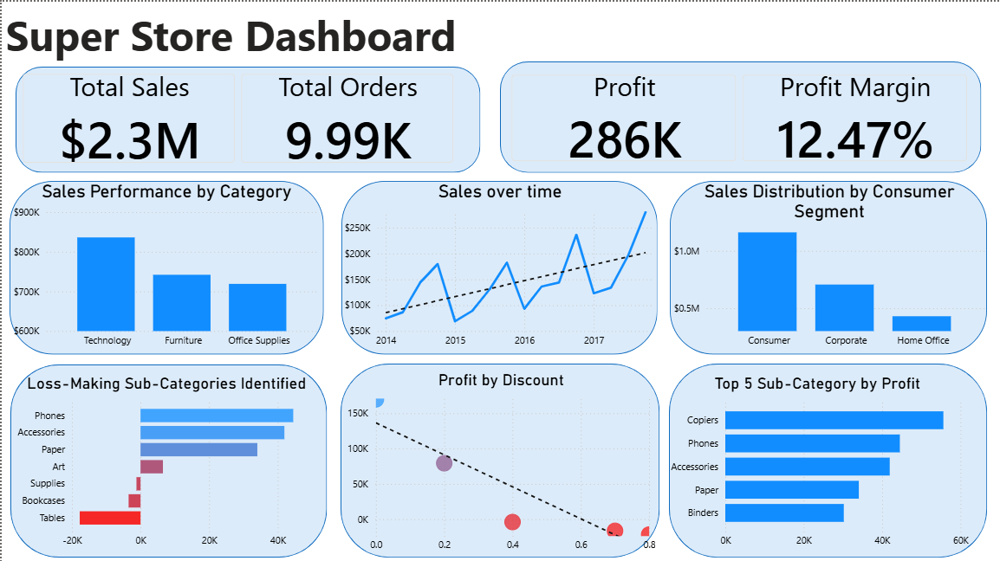
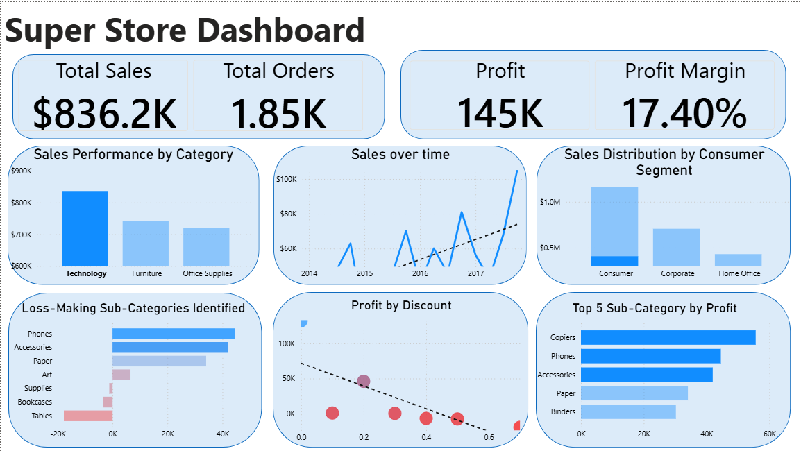
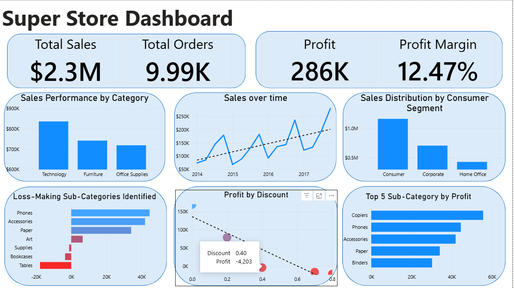
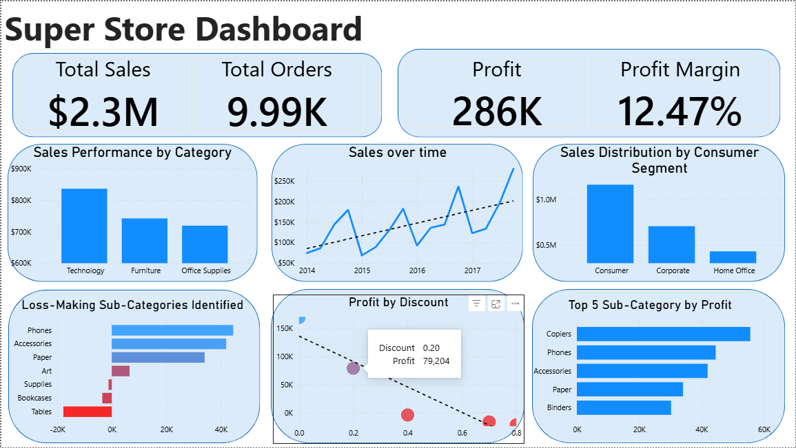

# Superstore Sales Analysis

I analyzed 4 years of retail sales data (2014–2017) to understand 
why the store's profit margin stayed low despite $2.3M in total sales.

The short answer: discounts.

---

## What I looked at

- 9,994 orders across 3 product categories and 17 sub-categories
- Sales, profit, and discount rates by region and customer segment
- Which products make money and which ones don't

---

## What I found

- Tables and Bookcases are losing money — the store is literally 
  paying to sell them because discounts are too high
- Technology is the best-performing category but gets the same 
  discount treatment as everything else, which is risky
- Copiers are quietly the most profitable sub-category (~$56K profit)
  with almost no discounting — that's not a coincidence
- The Consumer segment brings the most orders, but Corporate 
  clients are more profitable per order

---

## My recommendations

1. Stop discounting above 20% — the data shows profit goes negative 
   past that point
2. Seriously reconsider stocking Tables — $17K in losses is hard to justify
3. Don't touch Copiers pricing, it's working

---

## Tools

Power BI · Excel

## Data source

Kaggle — Superstore Dataset 
https://www.kaggle.com/datasets/binib1997/superstore?utm_source=chatgpt.com

##  Dashboard Screenshots

### Overview

### Interactive Filtering — Technology Category

### Discount Impact — Profit Goes Negative at 40% Discount

### Discount Impact — Profit at 20% Discount

